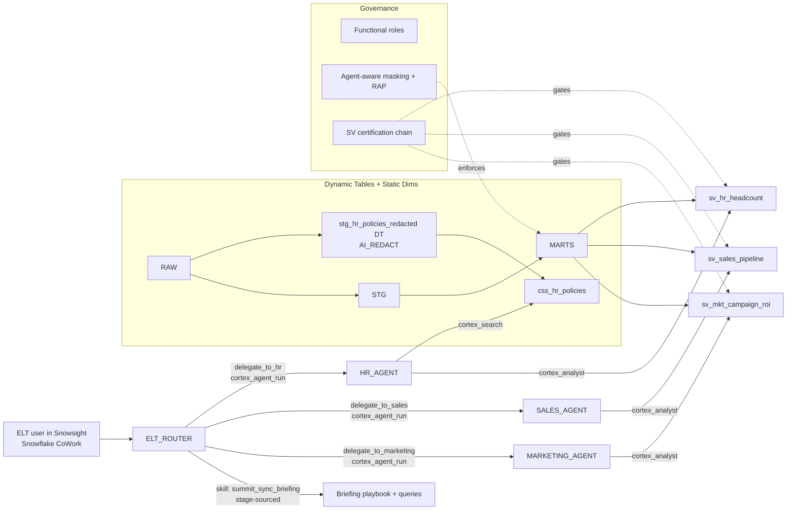
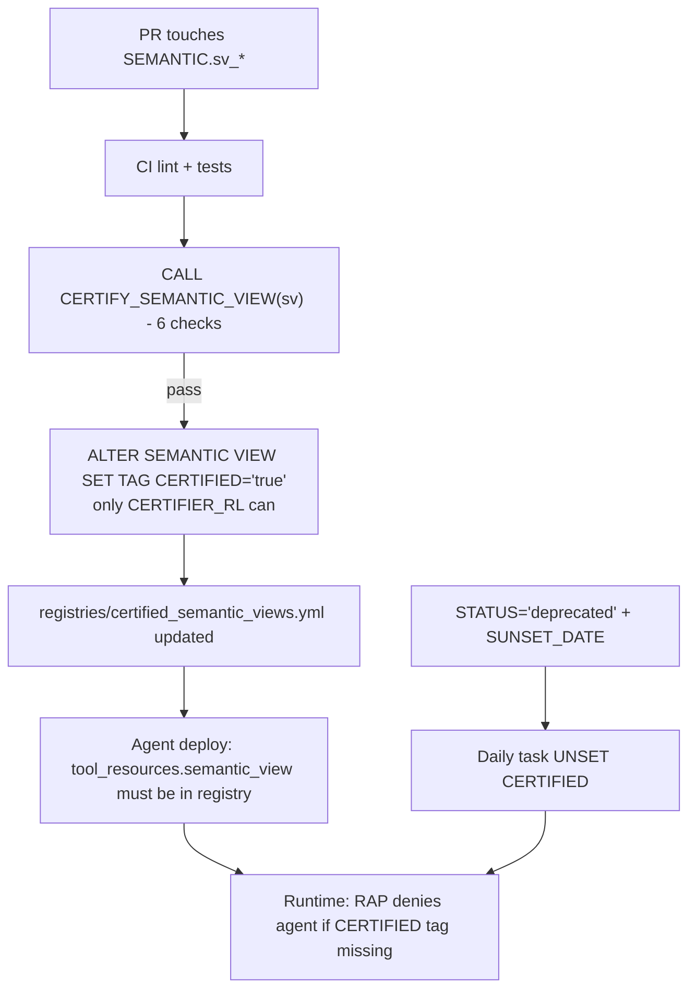
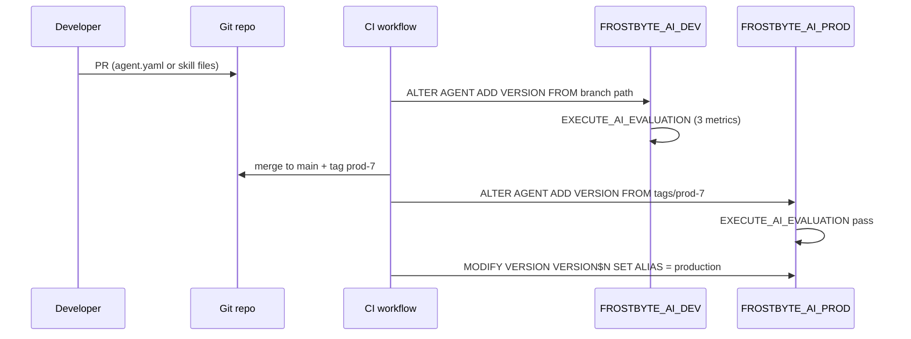

# Frostbyte ELT Multi-Agent Demo

> Companion to [company_brief.md](company_brief.md). Snowflake CoWork multi-agent system: 3 sub-agents (Marketing, Sales, HR) with optional MCP servers for external access + router using direct `cortex_agent_run` tools with stage-sourced *Summit Sync Briefing* skill + HR Cortex Search over `AI_REDACT`-cleaned policies. Agent-aware governance using `SYS_CONTEXT` (`IS_AGENT_ACTIVATED` + `AGENT_NAME` / `AGENT_TYPE` / `AGENT_DATABASE`) plus a semantic-view certification chain (procedure + tag + registry + sunset task). CI eval gate, native Cortex Agent versioning, Git-driven DEV -> PROD promotion.

---

## The Story (in 60 seconds)

Frostbyte Outfitters sells snow gear via DTC, Wholesale, and Frostbyte Pro. Three orgs spend ~140 hours/week prepping Monday's "Summit Sync" ELT meeting. We replace it with three Snowflake CoWork sub-agents (Marketing, Sales, HR) orchestrated by a router using direct `cortex_agent_run` tools, plus a stage-sourced *Summit Sync Briefing* skill. Trust by construction: certified semantic views over Dynamic Tables, PII masked at the column level and redacted inline for unstructured docs, **agent-aware** policies that enforce extra rules whenever a session is invoked by an agent, and a **semantic-view certification chain** that the runtime itself enforces. CI eval gate, native Cortex Agent versioning, Git-driven DEV -> PROD promotion.

**Demo highlights:**
1. *"Good morning"* triggers the personalized Summit Sync brief via the skill.
2. *"Are we hiring fast enough in EMEA to support the Cornice launch?"* — router fans out to all three sub-agents.
3. Live DEV -> PROD promotion of `SALES_AGENT` via Git tag + alias flip.
4. Live decertify / re-certify of `sv_hr_headcount` — agent gracefully reports "not certified" until re-certified.

Full story: [company_brief.md](company_brief.md).

---

## Architecture



**Scope:** two databases (`FROSTBYTE_AI_DEV` / `FROSTBYTE_AI_PROD`), 3 regions (NA / EMEA / JP), 2 product lines (Cornice / Glacier), 3 channels (DTC / Wholesale / Frostbyte Pro), 3 sub-agents + 3 optional MCP servers + 1 router (direct tools), 3 SVs, 1 Cortex Search service, 1 router skill, 2 eval metrics.

---

## Nine Demo Steps

```mermaid
flowchart LR
  s1["1. Seed data"] --> s2["2. PII auto + agent-aware policies"]
  s2 --> s3["3. DTs + Semantic Views"]
  s3 --> s4["4. Cortex Search for HR"]
  s4 --> s5["5. SV certification chain"]
  s5 --> s6["6. Sub-agents + optional MCP"]
  s6 --> s7["7. Router (direct tools) + skill"]
  s7 --> s8["8. CI eval gate + DEV -> PROD"]
  s8 --> s9["9. Live demo + rollback"]
```



### Step 1 — Seed synthetic Frostbyte data

Faker generates ~1.2K employees, ~2K accounts, ~5K opps, ~10K leads, 4 campaigns, an HR policy doc set with embedded PII (names, emails, employee IDs). Loaded into `FROSTBYTE_AI_DEV.RAW.*` via `COPY INTO`.

### Step 2 — PII automation with agent-aware policies

**Tier A — Role-based tag masking** (baseline)

```sql
CREATE MASKING POLICY GOVERNANCE.mp_mask_email AS (val STRING)
  RETURNS STRING ->
    CASE WHEN CURRENT_ROLE() IN ('HR_PII_RL','SECURITY_ADMIN') THEN val ELSE SHA2(val) END;
```

**Tier B — Agent-aware overlay** using `IS_AGENT_ACTIVATED` + agent identity (`AGENT_NAME`, `AGENT_TYPE`, `AGENT_DATABASE`):

```sql
CREATE OR REPLACE MASKING POLICY GOVERNANCE.mp_mask_email AS (val STRING)
  RETURNS STRING ->
    CASE
      WHEN SYS_CONTEXT('SNOWFLAKE$CURRENT','IS_AGENT_ACTIVATED') = 'TRUE' THEN
        CASE
          WHEN SYS_CONTEXT('SNOWFLAKE$CURRENT','AGENT_NAME') = 'HR_AGENT'
            THEN REGEXP_REPLACE(val, '^[^@]+', '****')         -- domain-preserving
          WHEN SYS_CONTEXT('SNOWFLAKE$CURRENT','AGENT_TYPE') = 'CORTEX_CODE_CLI'
            THEN '***REDACTED***'                                -- harder on CLI
          ELSE SHA2(val)                                          -- full hash for other agents
        END
      WHEN CURRENT_ROLE() IN ('HR_PII_RL','SECURITY_ADMIN') THEN val
      ELSE SHA2(val)
    END;
```

**Tier C — Agent-aware row access**:

```sql
CREATE OR REPLACE ROW ACCESS POLICY GOVERNANCE.rap_hr_employee_scope
  AS (manager_chain ARRAY) RETURNS BOOLEAN ->
    CASE
      WHEN SYS_CONTEXT('SNOWFLAKE$CURRENT','IS_AGENT_ACTIVATED') = 'TRUE' THEN
        SYS_CONTEXT('SNOWFLAKE$CURRENT','AGENT_NAME') = 'HR_AGENT'
        AND SYS_CONTEXT('SNOWFLAKE$CURRENT','AGENT_DATABASE') LIKE 'FROSTBYTE_AI_%'
      WHEN ARRAY_CONTAINS(CURRENT_USER()::VARIANT, manager_chain) THEN TRUE
      WHEN IS_ROLE_IN_SESSION('HR_PII_RL') THEN TRUE
      ELSE FALSE
    END;
```

**Tier D — Per-agent audit**: every agent-context PII access writes a row to `GOVERNANCE.PII_AUDIT_EVENTS` (event table) with `agent_type`, `agent_db`, `agent_schema`, `agent_name`, `pii_category`, `session_user`, `session_role`, `query_id`.

**Unstructured PII**: `SNOWFLAKE.CORTEX.AI_REDACT` inside a Dynamic Table feeds the HR Search service:

```sql
CREATE OR REPLACE DYNAMIC TABLE FROSTBYTE_AI_DEV.STG.stg_hr_policies_redacted
  TARGET_LAG = '1 hour' WAREHOUSE = WH_DT_S
  AS SELECT doc_id, title,
            SNOWFLAKE.CORTEX.AI_REDACT(content)::STRING AS content_redacted,
            last_updated
     FROM FROSTBYTE_AI_DEV.RAW.HR_POLICY_DOCS;
```

**Offline policy tests**: CI uses `POLICY_CONTEXT(SNOWFLAKE$CURRENT_AGENT_NAME => '...')` to assert per-agent / per-surface mask form for every PII category.

### Step 3 — Dynamic Tables + 3 Semantic Views

```
RAW.* -> STG.stg_* DT (TARGET_LAG '5 min') -> MARTS.dim_/fct_/agg_ DT (DOWNSTREAM)
                                           -> SEMANTIC.sv_mkt_campaign_roi
                                           -> SEMANTIC.sv_sales_pipeline
                                           -> SEMANTIC.sv_hr_headcount
RAW.HR_POLICY_DOCS -> STG.stg_hr_policies_redacted DT -> css_hr_policies
```

Shared dimensions: `dim_account`, `dim_employee`, `dim_region`, `dim_product_line` (DTs); `dim_date`, `dim_channel` (plain tables — static reference data). Default filters baked into SVs (`ACTIVE_STATUS = 1`, latest snapshot, channel-aware ARR — DTC vs Wholesale vs Frostbyte Pro).

### Step 4 — Cortex Search service for HR

```sql
CREATE OR REPLACE CORTEX SEARCH SERVICE FROSTBYTE_AI_DEV.SEARCH.css_hr_policies
  ON content_redacted ATTRIBUTES title, last_updated
  WAREHOUSE = WH_DT_S TARGET_LAG = '1 hour'
  AS (SELECT doc_id, title, content_redacted, last_updated
      FROM FROSTBYTE_AI_DEV.STG.stg_hr_policies_redacted);
```

### Step 5 — Semantic View certification chain

Five enforcement layers so "certified" is not just a label.



#### 5.1 Definition (6 checks)

| # | Check | Source |
|---|---|---|
| C1 | All upstream DTs have `CERTIFIED='true'` + `STATUS='active'` | `TAG_REFERENCES` |
| C2 | Every `PII_CATEGORY` column has an attached masking policy | `T_VERIFY` |
| C3 | DQ tests pass (uniqueness, not-null, accepted-values, row_count > 0) | `tests/sv_<name>.sql` |
| C4 | Schema lint: descriptions, naming convention, >= 1 VQR | `lint/sv_lint.py` |
| C5 | Owner approval: PR label `domain-approved-<owner>` matches `OWNER` tag | CI context |
| C6 | Eval impact: every agent that pins the SV still passes its eval thresholds | `EVAL.RUNS` |

#### 5.2 Procedure

```sql
CREATE OR REPLACE PROCEDURE GOVERNANCE.CERTIFY_SEMANTIC_VIEW(SV_NAME STRING)
RETURNS OBJECT LANGUAGE SQL EXECUTE AS OWNER AS
$$
-- Runs C1..C6; on full pass: ALTER ... SET TAG CERTIFIED='true' and append CERTIFICATION_HISTORY.
-- On any failure: UNSET tag + write failed_checks list.
$$;
```

Only `CERTIFIER_RL` has `OWNERSHIP` on the procedure and `APPLY` on the `CERTIFIED` tag.

#### 5.3 Tag

```sql
CREATE TAG GOVERNANCE.CERTIFIED ALLOWED_VALUES 'true','false';
GRANT APPLY ON TAG GOVERNANCE.CERTIFIED TO ROLE CERTIFIER_RL;
```

#### 5.4 Registry

`registries/certified_semantic_views.yml` (committed in Git, CI-synced):

```yaml
- sv: FROSTBYTE_AI_PROD.SEMANTIC.SV_HR_HEADCOUNT
  env: PROD
  certified_at: 2026-06-23T10:14:00Z
  git_tag: prod-7
  consumed_by_agents: [HR_AGENT, ELT_ROUTER]
```

CI fails the PR if an agent's `tool_resources.semantic_view` is missing from the registry for the target env.

#### 5.5 Runtime gate

A row access policy on all mart DTs that the SVs read:

```sql
CREATE OR REPLACE ROW ACCESS POLICY GOVERNANCE.rap_require_certified_for_agent
  AS () RETURNS BOOLEAN ->
    CASE
      WHEN SYS_CONTEXT('SNOWFLAKE$CURRENT','IS_AGENT_ACTIVATED') != 'TRUE' THEN TRUE
      WHEN EXISTS (
        SELECT 1
        FROM TABLE(SNOWFLAKE.ACCOUNT_USAGE.TAG_REFERENCES(
                    SYS_CONTEXT('SNOWFLAKE$CURRENT','AGENT_DATABASE') ||
                    '.SEMANTIC.' || CURRENT_SEMANTIC_VIEW(),
                    'SEMANTIC_VIEW'))
        WHERE TAG_DATABASE = 'GOVERNANCE'
          AND TAG_NAME     = 'CERTIFIED'
          AND TAG_VALUE    = 'true'
      ) THEN TRUE
      ELSE FALSE
    END;
```

An agent calling an uncertified SV gets **0 rows** plus a policy denial in `QUERY_HISTORY`. The agent surfaces *"this metric is not currently certified"* rather than fabricating an answer.

#### 5.6 Sunset = automatic revocation

```sql
CREATE TASK GOVERNANCE.T_REVOKE_CERTIFICATION_ON_SUNSET
  WAREHOUSE = WH_GOV SCHEDULE = 'USING CRON 0 0 * * * UTC'
AS
  -- UNSET CERTIFIED on any SV whose STATUS='deprecated' AND CURRENT_DATE >= SUNSET_DATE.
;
```

### Step 6 — Sub-agents (+ optional MCP servers for external access)

Each sub-agent is `CREATE AGENT ... FROM SPECIFICATION`. MCP servers are created alongside for external client access (Cursor, Claude Desktop) but the router uses direct `cortex_agent_run` tools (see Step 7 design note).

HR agent (illustrative — both Analyst + Search):

```sql
CREATE OR REPLACE AGENT FROSTBYTE_AI_DEV.AGENTS.HR_AGENT
  PROFILE = '{"display_name":"HR_AGENT"}'
  FROM SPECIFICATION $$
  {
    "models": { "orchestration": "claude-sonnet-4-6" },
    "instructions": {
      "orchestration": "Frostbyte HR assistant. Use hr-headcount-data for structured questions and hr-policy-search for policy lookup. Apply ACTIVE_STATUS=1 and the latest snapshot. Refuse questions about individual compensation."
    },
    "tools": [
      { "tool_spec": { "type": "cortex_analyst_text_to_sql", "name": "hr-headcount-data", "description": "Headcount, attrition, comp distribution from sv_hr_headcount." } },
      { "tool_spec": { "type": "cortex_search",            "name": "hr-policy-search",   "description": "Search Frostbyte HR policies." } }
    ],
    "tool_resources": {
      "hr-headcount-data": { "execution_environment": { "type": "warehouse", "warehouse": "WH_AGENT" },
                             "semantic_view": "FROSTBYTE_AI_DEV.SEMANTIC.SV_HR_HEADCOUNT" },
      "hr-policy-search":  { "search_service": "FROSTBYTE_AI_DEV.SEARCH.CSS_HR_POLICIES",
                             "title_column": "TITLE", "id_column": "DOC_ID", "max_results": 5 }
    }
  } $$;

CREATE OR REPLACE MCP SERVER FROSTBYTE_AI_DEV.AGENTS.HR_AGENT_SERVER
  FROM SPECIFICATION $$
  tools:
    - title: "Delegate to HR sub-agent"
      name: "delegate_to_hr"
      type: "CORTEX_AGENT_RUN"
      identifier: "FROSTBYTE_AI_DEV.AGENTS.HR_AGENT"
      description: "HR sub-agent. Headcount, attrition, comp distribution, HR policy lookup."
  $$;
```

`MARKETING_AGENT` (with `cortex_analyst` over `sv_mkt_campaign_roi`) and `SALES_AGENT` (with `cortex_analyst` over `sv_sales_pipeline`) follow the identical pattern, each with an optional MCP server (`MARKETING_AGENT_SERVER`, `SALES_AGENT_SERVER`) for external access.

Grants:

```sql
GRANT USAGE ON AGENT MARKETING_AGENT TO ROLE ELT_MKT_RL;
GRANT USAGE ON AGENT SALES_AGENT     TO ROLE ELT_SALES_RL;
GRANT USAGE ON AGENT HR_AGENT        TO ROLE ELT_HR_RL;

GRANT USAGE ON MCP SERVER MARKETING_AGENT_SERVER TO ROLE ELT_RL;
GRANT USAGE ON MCP SERVER SALES_AGENT_SERVER     TO ROLE ELT_RL;
GRANT USAGE ON MCP SERVER HR_AGENT_SERVER        TO ROLE ELT_RL;
```

### Step 7 — Router agent + Summit Sync Briefing skill

Skill on stage (uploaded from local files; Git-sourced once repo is set up):

```
@FROSTBYTE_AI_DEV.ARTIFACTS.AGENT_SKILLS/summit_sync_briefing/
  SKILL.md            (triggers: "good morning", "summit sync", "monday brief", "catch me up")
  queries/user_context.sql   (resolves CURRENT_USER() -> first_name, region, org_filter from dim_employee)
  references/output_template.md
```

Workflow: UC-1 -> greeting -> fan out to `delegate_to_marketing`, `delegate_to_sales`, `delegate_to_hr` -> synthesize per `output_template.md` (Top of mind / 3 sections / Watch list).

**Design decision — direct tools vs MCP connectors:**
- `EXECUTE_AI_EVALUATION` does not support agents with MCP connectors (known limitation).
- Direct `cortex_agent_run` tools give identical runtime behavior (sub-agents remain encapsulated).
- MCP servers are retained alongside for external client access but not used by the router.
- Same coupling either way (both reference sub-agent by name).

Router:

```sql
CREATE OR REPLACE AGENT FROSTBYTE_AI_DEV.AGENTS.ELT_ROUTER
  PROFILE = '{"display_name":"Frostbyte ELT Router"}'
  FROM SPECIFICATION $$
  {
    "models": { "orchestration": "claude-sonnet-4-6" },
    "instructions": {
      "orchestration": "For 'good morning' / 'summit sync' / 'monday brief' / 'catch me up' triggers, follow summit_sync_briefing exactly. Otherwise route to delegate_to_marketing (campaigns/MQL/influence), delegate_to_sales (pipeline/ARR/pre-orders), delegate_to_hr (headcount/attrition/policy). Cross-domain questions: fan out in parallel and synthesize with per-sub-agent citations. Never fabricate."
    },
    "tools": [
      { "tool_spec": { "type": "cortex_agent_run", "name": "delegate_to_marketing",
          "description": "Marketing sub-agent.", "agent": "FROSTBYTE_AI_DEV.AGENTS.MARKETING_AGENT" } },
      { "tool_spec": { "type": "cortex_agent_run", "name": "delegate_to_sales",
          "description": "Sales sub-agent.", "agent": "FROSTBYTE_AI_DEV.AGENTS.SALES_AGENT" } },
      { "tool_spec": { "type": "cortex_agent_run", "name": "delegate_to_hr",
          "description": "HR sub-agent.", "agent": "FROSTBYTE_AI_DEV.AGENTS.HR_AGENT" } }
    ],
    "skills": [
      { "name": "summit_sync_briefing",
        "source": { "type": "STAGE",
                    "path": "@FROSTBYTE_AI_DEV.ARTIFACTS.AGENT_SKILLS/summit_sync_briefing" } }
    ]
  } $$;
GRANT USAGE ON AGENT ELT_ROUTER TO ROLE ELT_RL;
```

### Step 8 — CI eval gate + Git-driven DEV -> PROD promotion

| Metric | Type | Threshold |
|---|---|---|
| `answer_correctness` | built-in, ground-truth | >= 0.75 |
| `logical_consistency` | built-in, reference-free | >= 0.80 |

LLM judge uses cross-region inference (model selected by Snowflake). Eval datasets per agent stored in `EVAL` schema. **Important:** `EXECUTE_AI_EVALUATION` must be called from `USE SCHEMA AGENTS` (the agent's schema) or the judge will fail to resolve the agent name.

Router dataset includes cross-domain fan-out, *"Good morning"* skill trigger, and policy refusal tests.



Live SQL on stage:

```sql
ALTER AGENT FROSTBYTE_AI_PROD.AGENTS.SALES_AGENT
  ADD VERSION FROM @FROSTBYTE_AI_PROD.ARTIFACTS.GIT_REPO/tags/prod-7/agents/sales;
CALL FROSTBYTE_AI_PROD.EVAL.RUN_EVAL('SALES_AGENT', 'VERSION$2', 'ds_sales_summit_sync_v1');
ALTER AGENT FROSTBYTE_AI_PROD.AGENTS.SALES_AGENT MODIFY VERSION VERSION$2 SET ALIAS = production;
```

### Step 9 — Live demo run + rollback

1. **Open Snowflake CoWork as `ELT_RL`.** Type *"Good morning"* — skill triggers, three parallel `CORTEX_AGENT_RUN` calls, single Summit Sync brief.
2. **Cross-domain ad-hoc**: *"Are we hiring fast enough in EMEA to support the Cornice launch?"*.
3. **HR Search + Analyst**: *"What is our parental leave policy for EMEA, and how many EMEA hires are pending?"* — HR agent uses both tools; redacted citations.
4. **Per-agent mask shape**: same `HR_PII_RL` user, two different agents, two different mask forms — show the policy body live.
5. **Per-agent row access**: a Sales-agent query against `dim_employee` returns 0 rows; HR-agent path returns rows.
6. **Certification gate**: `ALTER ... UNSET TAG CERTIFIED` on `sv_hr_headcount` -> re-ask *"Good morning"* -> HR slice reports "not certified"; Mkt + Sales still answer. `CALL CERTIFY_SEMANTIC_VIEW(...)` -> full briefing returns.
7. **RBAC switch**: connect as `ELT_HR_RL` (direct HR agent works; others denied).
8. **Promote**: run the three SQL statements from Step 8 live; ask the question again, observe new behavior.
9. **Rollback** one statement:
   ```sql
   ALTER AGENT FROSTBYTE_AI_PROD.AGENTS.SALES_AGENT
     MODIFY VERSION VERSION$1 SET ALIAS = production;
   ```

---

## Verification (demo checklist)

| Check | How |
|---|---|
| PII masked (structured) | `sv_hr_headcount` under `ELT_HR_RL` returns hashed comp; `HR_PII_RL` returns plaintext from a worksheet |
| PII redacted (unstructured) | HR Search results show `[REDACTED]` where source had names/emails |
| Agent-aware mask | Same `HR_PII_RL` user gets `SHA2` via Marketing agent and `****@frostbyte.com` via HR agent |
| Surface-aware mask | `POLICY_CONTEXT` simulating `AGENT_TYPE='CORTEX_CODE_CLI'` returns the harder mask |
| Per-agent RAP | Sales-agent select on `dim_employee` returns 0 rows; HR-agent select returns rows |
| Per-agent audit | `PII_AUDIT_EVENTS` shows one row per agent invocation with `agent_name`, `agent_type`, `agent_db` |
| Tag constraint | `ALTER SEMANTIC VIEW ... SET TAG CERTIFIED='maybe'` fails on `ALLOWED_VALUES` |
| Only CERTIFIER_RL applies tag | Other roles fail with "insufficient privileges" |
| Runtime certification gate | Decertify -> agent invocation returns 0 rows + policy denial |
| Registry sync | CI fails if agent references non-certified SV in target env |
| Sunset revokes | `STATUS='deprecated'` + past `SUNSET_DATE` -> tag removed by daily task |
| RBAC works | Marketing role denied on HR SV; sub-agents denied without their role; `ELT_RL` can use the router |
| Router delegates to sub-agents | Query log shows three `CORTEX_AGENT_RUN` tool calls under one router invocation |
| HR agent uses both tools | One question shows two tool invocations (Analyst + Search) |
| Skill triggers | *"Good morning"* runs UC-1 + 3 delegations + emits the templated brief |
| `answer_correctness` gate | Force one wrong answer; CI blocks PR |
| `logical_consistency` gate | Inject contradictory router synthesis; gate blocks |
| `pii_safety` gate | Point HR Search at non-redacted column; gate blocks |
| DEV -> PROD promotion | `tags/prod-7` flows: `ADD VERSION` -> eval -> alias flip |
| Skill promotion | Update skill files in Git; new tag; router serves new behavior on next call |
| Rollback | One `MODIFY VERSION SET ALIAS = production` |

---

## Implementation Steps (consolidated)

1. Seed Frostbyte data into RAW (structured + HR policy docs with embedded PII).
2. Build PII automation: tag-based masking (Tier A), agent-aware overlay using `IS_AGENT_ACTIVATED` + `AGENT_NAME` / `AGENT_TYPE` / `AGENT_DATABASE` (Tier B), agent-aware RAP (Tier C), `PII_AUDIT_EVENTS` event table (Tier D). `AI_REDACT` inside HR Search-feed DT. CI policy tests via `POLICY_CONTEXT`.
3. Build Dynamic Tables pipeline (`stg_` -> `int_` -> `marts/`) + 3 semantic views with shared dimensions.
4. Create Cortex Search service `css_hr_policies` over redacted DT.
5. Build SV certification chain: `CERTIFIED` tag with `ALLOWED_VALUES`; `CERTIFIER_RL` with `APPLY`; `CERTIFY_SEMANTIC_VIEW` procedure (6 checks); `CERTIFICATION_HISTORY` table; `rap_require_certified_for_agent` runtime gate on mart DTs; `T_REVOKE_CERTIFICATION_ON_SUNSET` task. Registry `certified_semantic_views.yml` + CI sync.
6. Create 3 sub-agents (HR with Analyst + Search) + 3 optional MCP servers (for external client access).
7. Author `summit_sync_briefing` skill (`SKILL.md` + `queries/` + `references/`) on stage.
8. Create router agent with 3 direct `cortex_agent_run` tools + stage-sourced skill.
9. CI eval gate (2 metrics: `answer_correctness`, `logical_consistency`); per-agent eval datasets in `EVAL` schema. Run from `USE SCHEMA AGENTS`.
10. Wire DEV -> PROD promotion via Git tag + `ADD VERSION FROM @stage` + alias flip (deferred until Git repo is set up).
11. Run live demo (the 9-step script above) in Snowflake CoWork.

---

## Critical Files

- [company_brief.md](company_brief.md) — Frostbyte storyline.
- [Snowflake docs: SYS_CONTEXT SNOWFLAKE$CURRENT](https://docs.snowflake.com/en/sql-reference/functions/sys_context_snowflake_current) — `IS_AGENT_ACTIVATED`, `AGENT_NAME`, `AGENT_TYPE`, `AGENT_DATABASE`, `AGENT_SCHEMA`.
- [Snowflake docs: POLICY_CONTEXT](https://docs.snowflake.com/en/sql-reference/functions/policy_context) — agent-identity simulators for offline policy tests.
- [Snowflake docs: Cortex Agent versioning](https://docs.snowflake.com/en/user-guide/snowflake-cortex/cortex-agents-versioning) — native LIVE / VERSION$N / aliases.
