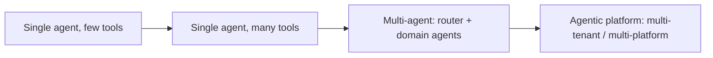
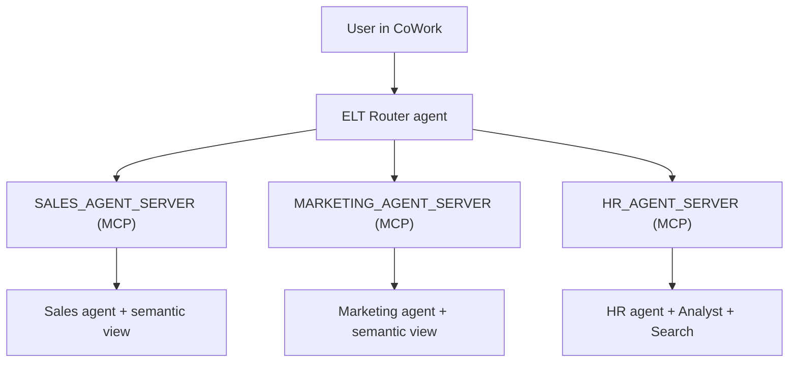
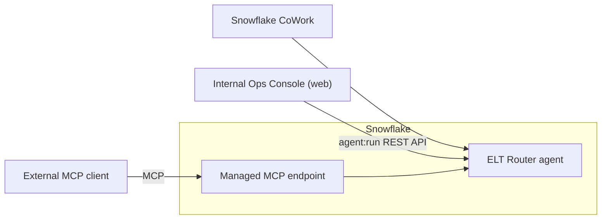
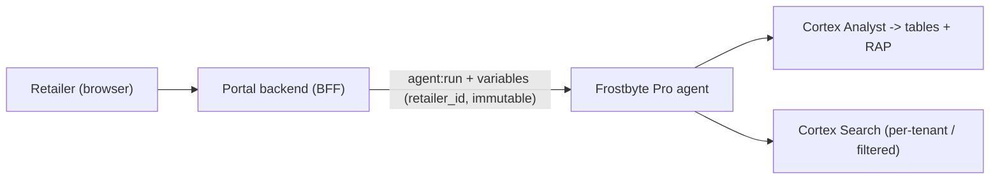
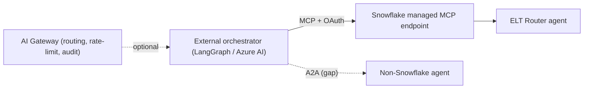

# Multi-Agent Reference Architecture on Snowflake

**Audience:** AFEs / SEs advising customers on multi-agent architectures
**Status:** Current as of July 2026. Capabilities validated against Snowflake product docs; forward-looking gaps are labeled by confidence.
**Companion demo:** The `multi-agent-pipeline/` project in this repo (Frostbyte ELT) is the reference implementation for Pattern 1.

> **Confidence tags used throughout:** `[VALIDATED]` = confirmed in Snowflake docs or this repo · `[FIELD-VALIDATED]` = confirmed via internal Jira/Slack, not yet in public docs · `[INFERENCE]` = absence-of-feature deduction, confirm before quoting · `[NEEDS INTERNAL VALIDATION]` = check Jira/Slack/roadmap.

---

## 1. Setting the Scene

Most customers do not start with a multi-agent system. They start with **one agent and a growing pile of tools**, and they do well — until they don't. This document exists because the most common question in the field right now is: *"We have one agent. Should we split it, and if so, how do we scale safely?"*

### The agentic maturity curve

| Stage | Signal you are here | Signal you should move on |
|---|---|---|
| Single agent, few tools | 1 domain, 2-5 tools, one team | Tool list crosses ~8; answers get noisy |
| Single agent, many tools | Cross-domain tools in one spec | Orchestration mis-selects tools; teams contend for the spec |
| Multi-agent | Router delegates to domain agents | You need per-tenant isolation or external embedding |
| Agentic platform | Agents embedded in apps / other platforms | Ongoing scale + governance concern |

### Do I actually need multiple agents?

Split when **at least one** is true:
- **Tool overload** — the orchestrator mis-selects among many tools; instructions get long and conflicting.
- **Team ownership** — different teams (Sales, Marketing, HR) need to own their agent's tools, skills, and release cadence independently.
- **Blast radius / governance** — you want a domain's data access and prompt surface isolated from others.
- **Reuse** — the same capability must be callable from multiple parents or external platforms.

Do **not** split just because you can. A single well-scoped agent with a handful of tools is cheaper, lower-latency, and easier to evaluate. Multi-agent adds orchestration hops, more surfaces to secure, and cross-agent context-propagation concerns (sections 4-6).

### Mapping to the 5-phase blueprint

| Blueprint phase | This document |
|---|---|
| 1 Foundation / 2 Develop / 3 Launch | Single-agent basics (pre-requisite; not covered here) |
| 4 Multi-Agent Platform | Patterns 1-4 (sections 2-5) |
| 5 Agentic Enterprise | Governance, identity, localization at scale (section 6) |

The four patterns below are ordered by how customers typically adopt them: **migrate (1) → embed (2) → multi-tenant (3) → multi-platform (4)**.

---

## 2. Pattern 1 — Migration: Flat Hierarchy to Multi-Agent

**Use case (Frostbyte ELT).** Frostbyte started with one agent holding Sales, Marketing, and HR tools. As the tool count crossed ~8 and each team wanted to own its own logic and release cadence, it was refactored into an **ELT Router** that delegates to focused **Sales / Marketing / HR sub-agents**, each exposed as a Snowflake-managed MCP server, plus a `summit_sync_briefing` skill for the Monday brief.

**Refactoring steps.**
1. Consolidate repeatable multi-step logic into **Skills** (`SKILL.md` on a stage/Git repo).
2. Extract **domain agents**, each with only the tools it needs (narrow scope = better tool selection).
3. **Wire delegation** from the router to each domain agent (two methods below).
4. Add the **router agent** with orchestration instructions describing when to call each domain.

### Agent-to-agent delegation: two methods

There is no native "call agent B from agent A" tool type. Two validated approaches:

| Dimension | Procedure-wrapped (`generic` tool -> `DATA_AGENT_RUN`) | MCP tool (`CREATE MCP SERVER` wraps child agent) |
|---|---|---|
| Security context | `EXECUTE AS OWNER` **resets** context (runs as proc owner) | Caller's rights **preserved** (invoking user's role) |
| Session vars / tenant context | Do **not** auto-propagate; re-forward in proc body | Flow through session; RAP + attributes enforced |
| RBAC / RAP enforcement | Broken by owner's rights unless re-applied | End-to-end (best for multi-tenant) |
| Input/output control | Full - transform, validate, enrich, log | Limited - declarative pass-through |
| Privilege containment/escalation | Deliberate via owner's rights | Cannot escalate; strict least-privilege |
| Reusability | In-account tool only | Reusable by external MCP clients, CoWork, other agents |
| Maturity | Stable pattern | Preview considerations |

**Guidance.** Use the **MCP tool** method when context must flow (multi-tenant, external, least-privilege) - this is what the Frostbyte repo uses. Use **procedure-wrapped** when you need input/output transformation or deliberate privilege boundaries. `[VALIDATED]`

**Gaps.** `[FIELD-VALIDATED]` No native agent-to-agent tool type (orchestrator -> managed MCP -> sub-agent is the field-standard pattern); `[VALIDATED]` owner's-rights wrapper procedures reset caller context (session variables do not inherit - section 6).

**Demo hook.** The existing `multi-agent-pipeline/` project - show the *before* (monolith spec) vs *after* (router + 3 MCP sub-agents + skill).

---

## 3. Pattern 2 — Multi-Agent via CoWork + API / MCP

**Use case (Frostbyte internal Ops Console).** The same ELT agents are consumed two ways: analysts chat with them **natively in Snowflake CoWork**, while an **internal Ops Console** web app embeds the ELT Router through the `agent:run` REST API. External MCP clients (e.g., Claude Desktop, LangGraph) can also reach the agents through the **Snowflake-managed MCP endpoint**.

**Embedding options.**
- **CoWork (native):** zero-code; agents appear automatically to authorized roles.
- **`agent:run` REST API:** `POST /api/v2/databases/{db}/schemas/{sch}/agents/{name}:run` with a thread for context. Auth via OAuth / PAT / key-pair JWT. Best for embedding into your own UI.
- **Cortex Code Agent SDK** (Python/TS) or **`cortex mcp serve`:** expose the full agent loop to external orchestrators.
- **Snowflake-managed MCP endpoint:** `.../mcp-servers/{name}` - any MCP-compatible client connects with OAuth.

**Controls.** Callers need the `SNOWFLAKE.CORTEX_AGENT_USER` (or `CORTEX_USER`) database role and `USAGE` on the agent; the agent runs under the **querying user's default role** (section 6).

**Gaps.** `[VALIDATED]` OAuth is not yet supported for the SPCS-hosted MCP external-client path (managed MCP servers do support OAuth).

**Demo hook.** A thin internal ops dashboard that calls `agent:run` and renders the router's answer.

---

## 4. Pattern 3 — Multi-Tenant, Embedded in a Website

**Use case (Frostbyte Pro partner portal).** Each retailer logs into a public **Frostbyte Pro** website and chats with an embedded assistant that answers **only about their own** orders, pipeline, and co-op marketing spend. Retailers are **not** Snowflake users.

**How isolation works.**
1. The portal backend authenticates the retailer via **its own** IdP/login (Model B, section 6).
2. It maps the authenticated user to `retailer_id` and passes it in the `agent:run` **`variables`** block with `is_immutable_session_attribute: true`.
3. Snowflake sets the attribute before any generated SQL runs; a **Row Access Policy** filters rows using `SYS_CONTEXT('SNOWFLAKE$SESSION_ATTRIBUTES', 'retailer_id')`.
4. Immutability prevents generated SQL or prompt injection from overriding the tenant key.

**Critical asymmetry - structured vs unstructured.** `[VALIDATED]` RAP + session attribute isolates the **Cortex Analyst / SQL** path. It does **not** carry to **Cortex Search**, which runs with **owner's rights** - any role with `USAGE` on the service sees the entire indexed corpus. For per-tenant unstructured data, use **separate Cortex Search services per tenant** (hard boundary via `USAGE` grants) or an `@eq` **filter** on a tenant attribute (soft, agent-driven). See section 6.

**Controls.** One least-privilege **service identity** (key-pair JWT recommended) holds `USAGE` on the agent + tools; the service role's grants form the **ceiling**, RAP carves the per-tenant slice.

**Gaps.** `[VALIDATED]` Cortex Search owner's-rights (above); `[VALIDATED]` no per-user Snowflake identity for external users - isolation is the app's shared responsibility.

**Demo hook.** A minimal partner-portal web app: login -> inject `retailer_id` -> tenant-scoped answers. (Front-end stack TBD - next step.)

---

## 5. Pattern 4 — Multi-Platform (A2A / MCP / AI Gateway)

**Use case (Frostbyte corporate AI).** Frostbyte's central AI platform runs on LangGraph/Azure. Rather than rebuild the ELT logic, it **reuses the Snowflake ELT Router as a tool** via the Snowflake-managed MCP endpoint (OAuth), so the corporate orchestrator can call Snowflake-governed data agents alongside its other tools.

**Integration patterns.**
- **Snowflake as tool provider:** external agents consume Snowflake agents through the managed MCP endpoint. `[VALIDATED]`
- **Snowflake as tool consumer:** a Snowflake agent uses an external MCP server as a tool (MCP connectors). `[VALIDATED]`
- **AI Gateway:** customers front multiple platforms with a gateway for routing, rate limiting, and centralized observability. Snowflake has **no built-in gateway** - this is an external component. `[INFERENCE]`

**A2A (Google Agent2Agent).** `[FIELD-VALIDATED]` Snowflake has **no native A2A support** today, and it is **not on the roadmap** (confirmed in field/Slack, Jun 2026). **MCP is the interoperability bridge.** If a customer standardizes on A2A, position an external A2A-to-MCP adapter and flag it as `[NEEDS INTERNAL VALIDATION]` against roadmap.

**Demo hook.** A small external orchestrator (e.g., LangGraph) calling the Snowflake router over MCP.

---

## 6. Governance, Security & Localization

This section is where multi-agent designs succeed or fail. The recurring theme: **agent instructions and skills are advisory to the LLM; only RBAC, RAP, and rights model are enforcement.**

### 6.1 Authentication & Identity

The first design decision for any embedded/multi-tenant agent is: **are your end users Snowflake users?** This routes you to one of two models.

| | Model A - Federated (users ARE Snowflake users) | Model B - Service identity (users are NOT Snowflake users) |
|---|---|---|
| Who | Internal employees via corporate SSO | External customers / partners / SaaS end-users |
| Auth | External OAuth (Okta, Entra, Ping) or Snowflake OAuth | App's own IdP/login; backend holds ONE Snowflake service identity |
| Snowflake credential | Per-user, token maps to a Snowflake user + role | PAT / key-pair JWT / OAuth client-credentials (one principal) |
| RBAC | **Per-user** - agent runs under the mapped role | **Shared** - all users share the service role's grants |
| Tenant isolation | Native RBAC + RAP per user | `agent:run` `variables` (immutable session attribute) + RAP |
| Secondary roles | External OAuth: yes · Snowflake OAuth: no | N/A (single service role) |

**Model A** (Pattern 2 internal): the IdP token carries a scope (`session:role:X` or `session:role-any`) that Snowflake maps to a user + role. RBAC works exactly as normal. Snowflake OAuth integrations can set `IS_AGENTIC = TRUE` so sessions are flagged agent-driven (`IS_AGENT_ACTIVATED`) for auditing.

**Model B** (Pattern 3 external): the app is the trust boundary. It authenticates its own users and maps each to a tenant key, then calls `agent:run` with that key as an **immutable session attribute**. How this links back to RBAC:

- The **service role's grants = the outer ceiling** — the maximum any tenant could ever reach (which agent, which tools, which tables).
- **RAP + the immutable session attribute carve each tenant's slice** within that ceiling. Immutability stops generated SQL / prompt injection from overriding the tenant key.
- **Shared responsibility:** Snowflake enforces RAP and attribute immutability; *you* own the user->tenant-key mapping. That mapping is the highest-risk code path — a bug there is a cross-tenant leak. Use a dedicated least-privilege service user.

### 6.2 The security-context propagation matrix

| Mechanism | Runs as | RAP / row policies on source | Session variables |
|---|---|---|---|
| Agent tool (Cortex Analyst / SQL) | Querying user's default role | **Enforced** (caller context) | Available |
| MCP-tool delegation (child agent) | Invoking user's role (caller's rights) | **Enforced** end-to-end | Flow through |
| Procedure-wrapped delegation (`EXECUTE AS OWNER`) | Procedure owner | **Reset** - re-apply manually | Do **not** inherit; re-forward explicitly |
| **Cortex Search** | **Service owner (owner's rights)** | **NOT enforced** for the querying user | N/A |

### 6.3 Cortex Search owner's-rights caveat `[VALIDATED]`

Cortex Search Services **perform searches with owner's rights**. Per Snowflake docs: *any role with `USAGE` on the service may query any data the service has indexed, regardless of that role's privileges on the underlying tables* — including rows a RAP would otherwise hide from the querying user.

Consequence — a **structured vs unstructured isolation asymmetry**:

| Path | Isolation mechanism | Per-user/tenant enforced? |
|---|---|---|
| Structured (Cortex Analyst / SQL) | RAP + immutable session attribute | Yes |
| Unstructured (Cortex Search) | Owner's rights - RAP **bypassed** | **No** |

To isolate unstructured data per tenant/region:
1. **Separate Cortex Search services per tenant/region**, gated by `USAGE` grants — **hard** boundary. (Recommended for real tenant isolation.)
2. An `@eq` **search filter** on a tenant/region attribute — **soft**, agent-driven and prompt-injectable; acceptable for UX scoping, not for security.

**Do not** rely on RAP alone once unstructured data is in the agent. Granting `USAGE` on a search service exposes its full indexed corpus.

### 6.4 Local vs Global markets (same agent, different behavior)

Frostbyte runs the same agents across NA / EMEA / JP but needs region-specific instructions (e.g., GDPR framing and EUR in EMEA) and region-scoped data. Recommended defense-in-depth, grounded in this repo's `summit_sync_briefing` skill:

1. **`CURRENT_ROLE()` SQL inside the skill** (`user_context.sql`) resolves a `domain`/region and branches **instructions/behavior**. Ideal for differentiating *what the agent says*. **Caveat:** this is a behavioral/UX layer, **not** a security control — skill instructions are advisory and bypassable. `[VALIDATED in repo]`
2. **Enforcement sits behind it:** RBAC on tools/MCP servers (`GRANT USAGE ON MCP SERVER ... TO ROLE <region_role>`) + RAP on data. The skill branch only skips what RBAC would deny anyway.
3. **Unstructured data:** per-region Cortex Search services (owner's-rights caveat, 6.3).
4. **Alternative:** separate agents per region (cleanest hard boundary; less DRY).

> **Footnote - secondary roles.** Cortex Agents evaluate only the querying user's **default/active primary role**; secondary-role privileges are not considered, and `CURRENT_ROLE()` returns the primary role. This only matters if your RBAC grants effective access via stacked secondary roles. The recommended **one-primary-role-per-persona** pattern (as `ELT_RL` does in this repo) avoids the issue. External OAuth can activate secondary roles; Snowflake OAuth cannot. `[VALIDATED]`

### 6.5 Audit & observability

Agent interactions are written to `SNOWFLAKE.LOCAL.AI_OBSERVABILITY_EVENTS` (content redacted by default; viewing requires an explicit grant). Use the `MONITOR` privilege on an agent to inspect its threads, logs, and traces. For Model B, correlate Snowflake-side activity (all under the one service user) with app-side per-user logs, since Snowflake sees only the service identity. **Multi-agent caveat:** sub-agents invoked over MCP currently run without a thread/parent-child link back to the orchestrator, so each surfaces as an independent trace — pass a shared correlation ID to stitch runs together (section 7.1).

---

## 7. Product Gaps & Recommendations

### 7.1 Gap matrix (current as of July 2026)

| Gap | Confidence | Affects | Workaround |
|---|---|---|---|
| Cortex Search runs owner's rights; RAP not enforced for querying user | `[VALIDATED]` | P3, local/global | Separate search services per tenant/region (hard) or `@eq` filter (soft) |
| Agents use querying user's **default/primary role** only; no secondary roles | `[VALIDATED]` | Governance | One-primary-role-per-persona; External OAuth if stacking needed |
| No per-skill RBAC at selection time | `[VALIDATED-NUANCED]` | Local/global | `CURRENT_ROLE()` branch in skill (advisory) + RBAC/RAP behind it |
| Owner's-rights wrapper procs reset caller context | `[VALIDATED]` | P1 delegation | Prefer MCP-tool delegation; or re-forward context in proc |
| OAuth not supported for SPCS-hosted MCP external clients | `[VALIDATED]` | P2, P4 | Use managed MCP servers (OAuth) for external clients |
| No native agent-to-agent tool type | `[FIELD-VALIDATED]` | P1 | Procedure-wrapped or MCP-tool delegation (orchestrator agent -> managed MCP -> sub-agent is the field-standard pattern) |
| No native A2A (Agent2Agent) support | `[FIELD-VALIDATED]` | P4 | MCP as the bridge; external A2A-to-MCP adapter. Confirmed not on roadmap (Slack, Jun 2026) |
| No built-in AI gateway / routing layer | `[INFERENCE]` | P4 | External gateway (routing, rate-limit, observability) |
| No automatic session-variable inheritance across owner's-rights boundary | `[INFERENCE]` | P1, P3 | Re-forward variables explicitly; prefer caller's-rights path |
| Chart rendering (`data_to_chart`) does not propagate through MCP | `[VALIDATED]` | P2, P4 | Render charts client-side from returned data; charts only in CoWork/native surfaces |
| Anthropic proxy enforces a ~60s idle timeout on Claude-proxied MCP calls (missing `claude/channel` keep-alive); long orchestrations return "operation timed out" client-side even though Snowflake completes | `[FIELD-VALIDATED]` | P2, P4 | **Resolved per SNOW-3440878** (keep-alive/progress notifications). For non-Claude clients on long orchestrations, stream progress or call the `agent:run` REST API directly |
| Sub-agent runs invoked over MCP have no thread / parent-child linkage to the orchestrator run; each appears as an independent trace | `[FIELD-VALIDATED]` | P1, observability | Pass a shared correlation ID in the prompt/variables and join app-side; native linkage roadmap TBD |
| CoWork main agent not yet callable via API | `[NEEDS INTERNAL VALIDATION]` | P2, P4 | Roadmap: main agent to be exposed via APIs by end of month |
| Agent identity for auditing: cannot fully audit actions an agent takes on behalf of a user | `[NEEDS INTERNAL VALIDATION]` | Governance / observability | Correlate app-side per-user logs with Snowflake events; roadmap PLT-56536 |

> Confirm all `[INFERENCE]` and roadmap items against internal Jira/Slack before quoting to a customer. `[NEEDS INTERNAL VALIDATION]`

### 7.2 Decision trees

**Which pattern?**
- One team, growing tool list -> **Pattern 1** (migrate to router + domain agents).
- Internal users need the agents outside CoWork -> **Pattern 2** (REST API / managed MCP).
- External users, per-customer data isolation -> **Pattern 3** (service identity + immutable session attribute + RAP).
- Reuse Snowflake agents from another AI platform -> **Pattern 4** (MCP bridge).

**Which delegation method?**
- Context/tenant/region must flow, or external reuse -> **MCP tool** (caller's rights).
- Need input/output transformation or deliberate privilege boundary -> **procedure-wrapped** (owner's rights).

**Which identity model?**
- Users are Snowflake users (internal SSO) -> **Model A** (federated, per-user RBAC).
- Users are not Snowflake users (external) -> **Model B** (service identity + RAP; app owns user->tenant mapping).

### 7.3 SA engagement approach

1. Locate the customer on the maturity curve (section 1); resist premature splitting.
2. Pick the pattern(s) via 7.2; confirm the identity model early — it drives the whole security design.
3. Stress-test isolation on **both** paths: structured (RAP) **and** unstructured (Cortex Search owner's rights).
4. Choose the delegation method per the security-context matrix (6.2).
5. Treat gaps (7.1) as design constraints; validate `[INFERENCE]` items against roadmap.

### 7.4 Next step: demos

Each pattern above carries a one-line **demo hook**. Pattern 1's demo is the existing `multi-agent-pipeline/` project. Patterns 2-4 are to be built next, following those use-case examples.
